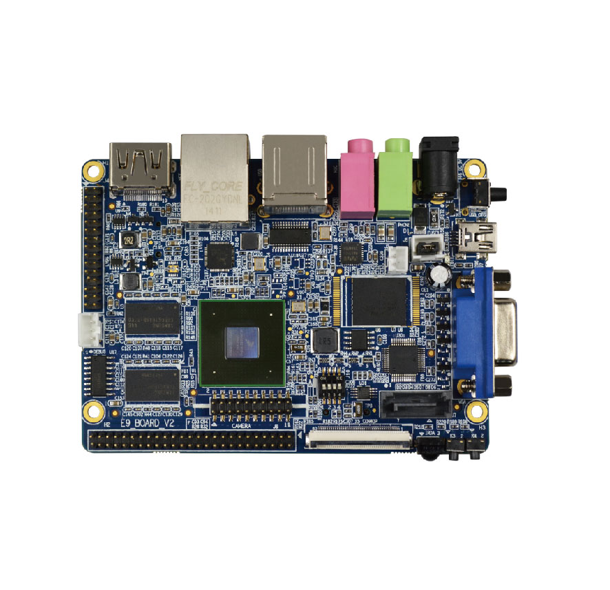
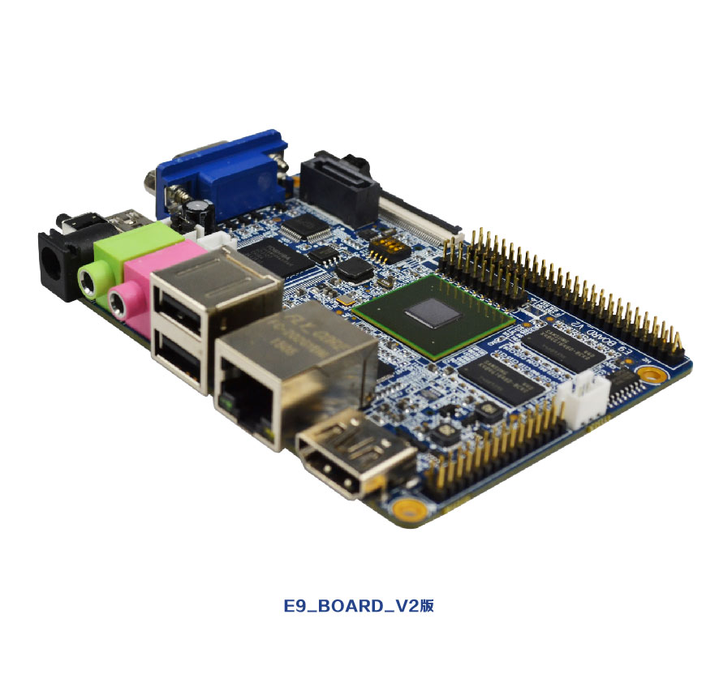

# I.MX6Q-SD-U-boot-Linux-Ramdisk

#### 介绍
I.MX6Q SD卡启动 + U-boot 2023.10-rc2 + Linux 6.5.0 + Ramdisk(busybox v1.36.1)

#### 硬件平台
天嵌E9v2卡片电脑

#### 软件架构
开发主机：树莓派4B  
主机系统：Raspberry Pi OS Lite (Debian version: 11 (bullseye))  
gcc 工具：arm-none-linux-gnueabihf-gcc   
gcc 版本：gcc version 12.3.1 20230626 (Arm GNU Toolchain 12.3.Rel1 (Build arm-12.35))  

#### 安装教程
1.  linux 内核编译
    cd linux-6.5 路径下执行build.sh 脚本
    编译完成后在 arch/arm/boot/ 下生成zImage 文件，在arch/arm/boot/dts/nxp/imx/ 下生成imx6q-sabresd.dtb 文件  
2.  u-boot 源码编译
    cd u-boot-2023.10-rc2 路径下执行build.sh 
    编译完成后 生成 u-boot-with-spl.imx 文件
3.  busybox 源码编译
    cd busybox-1.36.1 路径下创建busybox_install文件夹  
    根目录下执行build.sh，编译 安装 完成后在busybox_install 路径内生成最小文件系统  

#### 使用说明
1.  将 uboot 镜像烧录至SD卡
    cd u-boot-2023.10-rc2, 执行 sudo ./dd_uboot_sd.sh u-boot-with-spl.imx /dev/sdX 
2.  制作ramdisk 镜像文件
    cd ramdiskimagetool , 其中busybox_install 路径在busybox源码安装后添加gcc 工具下得lib库文件以及基本的配置。
    mkimage 工具为uboot 源码编译之后生成，执行 sudo ./makefs.sh ,脚本运行结束后生成 IMX6Q_RFS_xxxxxxxx_xxxxxx 文件夹，
    文件夹中包含最终的ramdisk.image文件。 
3.  制作boot.scr 启动脚本
    cd u-boot-2023.10-rc2/boot_scr , 更具需求更改boot.cmd.user 文件， 执行 ./make_boot_scr.sh ,在当前路径下生成boot.scr 文件。

#### 源码修改说明
1、linux内核源码当前修改仅支持调试串口、SD/MMC 、以太网，其他外设暂未移植  
2、u-boot 采用SPL + U-Boot 方式进行引导
#### 参与贡献

1.  Fork 本仓库
2.  新建 Feat_xxx 分支
3.  提交代码
4.  新建 Pull Request

#### 特技

1.  使用 Readme\_XXX.md 来支持不同的语言，例如 Readme\_en.md, Readme\_zh.md
2.  Gitee 官方博客 [blog.gitee.com](https://blog.gitee.com)
3.  你可以 [https://gitee.com/explore](https://gitee.com/explore) 这个地址来了解 Gitee 上的优秀开源项目
4.  [GVP](https://gitee.com/gvp) 全称是 Gitee 最有价值开源项目，是综合评定出的优秀开源项目
5.  Gitee 官方提供的使用手册 [https://gitee.com/help](https://gitee.com/help)
6.  Gitee 封面人物是一档用来展示 Gitee 会员风采的栏目 [https://gitee.com/gitee-stars/](https://gitee.com/gitee-stars/)
